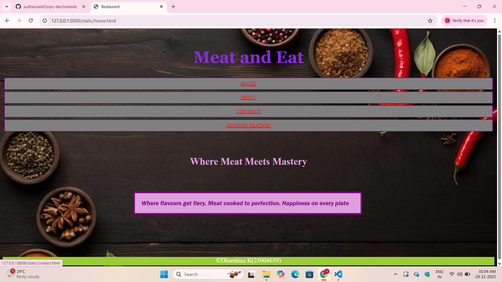
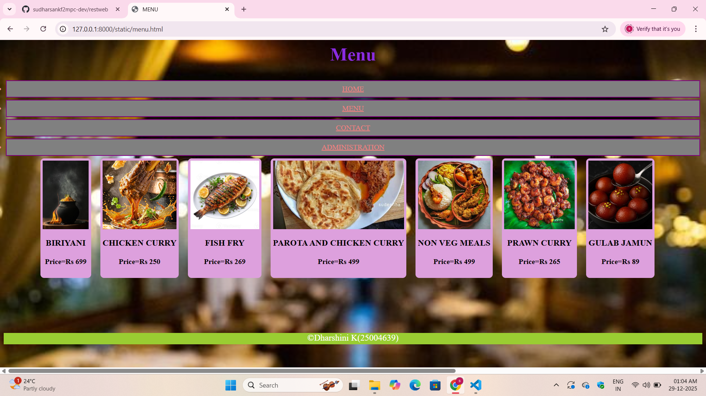
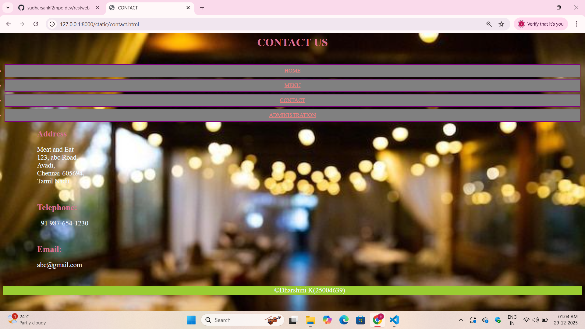
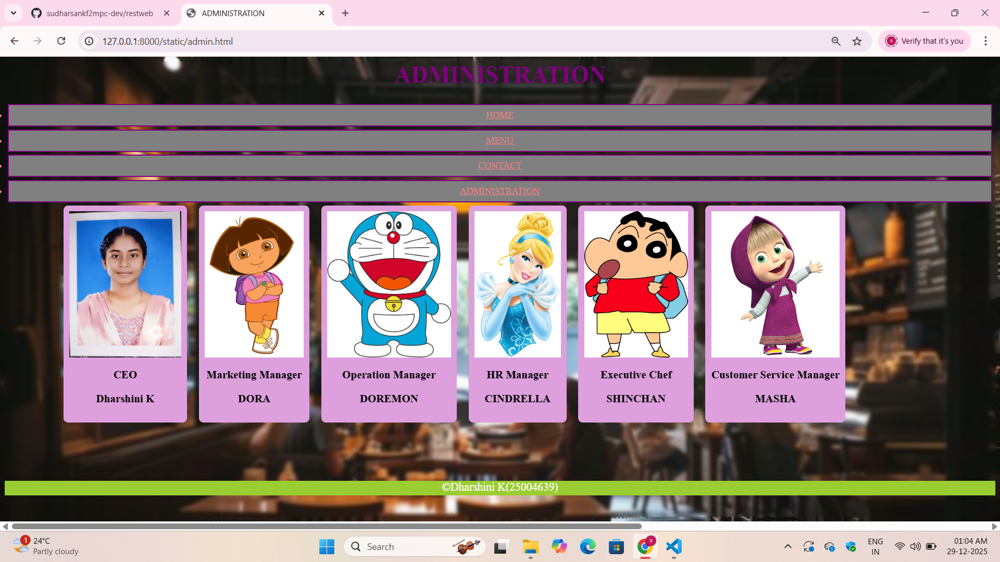

# Ex.06 Restaurant Website
## Date:29-12-2025

## AIM:
To develop a static Restaurant website to display the food items and services provided by them.

## DESIGN STEPS:

### Step 1:
Requirement collection.

### Step 2:
Creating the layout using HTML and CSS.

### Step 3:
Updating the sample content.

### Step 4:
Choose the appropriate style and color scheme.

### Step 5:
Validate the layout in various browsers.

### Step 6:
Validate the HTML code.

### Step 7:
Publish the website in the given URL.

## PROGRAM:
home Page
```
home.html
<html>
    <head>
        <title>Restaurent</title>
        <link href="home.css" rel="stylesheet">
    </head>
    <body>
        <br>
        <h1>Meat and Eat</h1>
        <div class="nav">
            <a href="home.html">HOME</a>
            <a href="menu.html">MENU</a>
            <a href="contact.html">CONTACT</a>
            <a href="admin.html">ADMINISTRATION</a>
        </div>
        <h2>Where Meat Meets Mastery</h2>
        <h3>Where flavours get fiery.
        Meat cooked to perfection.
        Happiness on every plate
        </h3>
    </body>
    <footer>
        <p>&copy;Dharshini K(25004639)</p>
    </footer>
</html>
home.css
body
{
    background-image: url('HOM.jpeg');
    background-repeat: no-repeat;
    background-size: cover;
}
h1
{
    color:blueviolet;
    font-size: 50px;
    text-align: center;
    font-family: Georgia, 'Times New Roman', Times, serif;
}
.nav
{
    text-align: center;
}
a
{
    display:list-item;
    padding: 8px 16px;
    margin: 5px;
    border: 2px solid purple;
    color:red;
    background-color:grey;
}
h2
{
    color: plum;
    padding: 50px;
    font-size: 30px;
    text-align: center;
}
h3
{
    background-color:plum ;
    padding:20px;
    font-family:'Franklin Gothic Medium', 'Arial Narrow', Arial, sans-serif;
    color:purple;
    border: 5px solid purple;
    font-style: italic;
    margin: 20px ;
    border-radius: 5px;
    width: 650px;
    margin-left: 400px;
    margin-bottom: 130px;
    align-items: center;
}
footer
{
    background-color:yellowgreen;
    text-align: center;
    color: white;
    height: 25px;
    font-size: larger;
}
```
Menu Page
```
menu.html
<html>
    <head>
        <title>MENU</title>
        <link href="menu.css" rel="stylesheet">
    </head>
    <body>
        <h2>Menu</h2>
        <div class="navigation">
            <a href="home.html">HOME</a>
            <a href="menu.html">MENU</a>
            <a href="contact.html">CONTACT</a>
            <a href="admin.html">ADMINISTRATION</a>
        </div>
        <div class="menubox">
            <div class="food">
            
                <h3>BIRIYANI</h3>
                <h4> Price=Rs 699</h4>
            </div>
            <div class="food">
                
                <h3>CHICKEN CURRY</h3>
                <h4> Price=Rs 250</h4>
            </div>
            <div class="food">
                
                <h3>FISH FRY</h3>
                <h4> Price=Rs 269</h4>
            </div>
            <div class="food">
                
                <h3>PAROTA AND CHICKEN CURRY</h3>
                <h4> Price=Rs 499</h4>
            </div>
            <div class="food">
                
                <h3>NON VEG MEALS </h3>
                <h4> Price=Rs 499</h4>
            </div>
            <div class="food">
                
                <h3>PRAWN CURRY</h3>
                <h4> Price=Rs 265</h4>
            </div>
            <div class="food">
                
                <h3>GULAB JAMUN</h3>
                <h4> Price=Rs 89</h4>
            </div>
        </div>  
    </body>
    <footer>
        <p>&copy;Dharshini K(25004639)</p>
    </footer>
</html>
menu.css
body
{
    background-image: url('CON.jpg');
    background-repeat: no-repeat;
    background-size: cover;
}
.navigation
{
    text-align: center;
}
a 
{
    display:list-item;
    padding: 8px 16px;
    margin: 5px;
    border: 2px solid purple;
    color:lightcoral;
    background-color:grey;
}
h2 {
    text-align: center;
    font-size: 40px;
    color:blueviolet;
}
.menubox {
    display: flex;
    gap: 20px;
    width: 150%;
    margin-left: 80px;
    margin-bottom: 120px;
}

.food {
    background-color: plum;
    padding: 5px;
    text-align: center;
    border-radius: 8px;
    
}

.food img {
    width: 100%;
    height: 150px;
    object-fit: cover;
}
footer
{
    background-color:yellowgreen;
    text-align: center;
    color: white;
    height: 25px;
    font-size: larger;
}
```
Contact Page
```
contact.html
<html>
    <head>
        <title>CONTACT</title>
        <link href="contact.css" rel="stylesheet">
    </head>
    <body>
        <h1>CONTACT US</h1>
        <br>
        <div class="navigation">
            <a href="home.html">HOME</a>
            <a href="menu.html">MENU</a>
            <a href="contact.html">CONTACT</a>
            <a href="admin.html">ADMINISTRATION</a>
        </div>
        <h2>Address</h2>
        <p>Meat and Eat
        <br>
        123, abc Road, 
        <br>
        Avadi,
        <br>
        Chennai-605694,
        <br>
        Tamil Nadu</p>
        <h2>Telephone:</h2>
        <p>+91 987-654-1230</p>
        <h2>Email:</h2>
        <p>abc@gmail.com</p>
    </body>
    <footer>
        <p>&copy;Dharshini K(25004639)</p>
    </footer>
</html>
contact.css
body
{
    background-image: url('CON.jpg');
    background-repeat: no-repeat;
    background-size: cover;
}
.navigation
{
    text-align: center;
}
a 
{
    display:list-item;
    padding: 8px 16px;
    margin: 5px;
    border: 2px solid purple;
    color:lightcoral;
    background-color:grey;
}
h1
{
    color:palevioletred;
    text-align: center;
}
h2{
    color:palevioletred;
    align-items: left;
    font-size: 25px;
    margin-left: 100px;
}
p
{
    color:aliceblue;
    font-size: 20px;
    align-items: left;
    margin-left: 100px;
    margin-bottom: 50px;
}
footer
{
    background-color:yellowgreen;
    text-align: center;
    color: white;
    height: 25px;
    font-size: larger;
}
```
Administration
```
admin.html
<html>
    <head>
        <title>ADMINISTRATION</title>
        <link href="admin.css" rel="stylesheet">
    </head>
    <body>
        <h1>ADMINISTRATION</h1>
        <div class="navigation">
            <a href="home.html">HOME</a>
            <a href="menu.html">MENU</a>
            <a href="contact.html">CONTACT</a>
            <a href="admin.html">ADMINISTRATION</a>
        </div>
        <div class="admin">
            <div class="team">
                
                <h3>CEO</h3>
                <h3>Dharshini K</h3>
            </div>
            <div class="team">
                
                <h3>Marketing Manager</h3>
                <h3>DORA</h3>
            </div>
            <div class="team">
                
                <h3>Operation Manager</h3>
                <h3>DOREMON</h3>
            </div>
            <div class="team">
                
                <h3>HR Manager</h3>
                <h3>CINDRELLA</h3>
            </div>
            <div class="team">
                
                <h3>Executive Chef</h3>
                <h3>SHINCHAN</h3>
            </div>
            <div class="team">
                
                <h3>Customer Service Manager</h3>
                <h3>MASHA</h3>
            </div>
        </div>
    </body>
    <footer>
        <p>&copy;Dharshini K(25004639)</p>
    </footer>
</html>
admin.css
body
{
    background-image: url('ad.jpeg');
    background-size: cover;
    background-repeat: no-repeat;
    backdrop-filter: blur(3px)
}
h1
{
    text-align: center;
    font-size: 40px;
    color:purple;
}
.navigation
{
    text-align: center;
}
a
{
    display:list-item;
    padding: 8px 16px;
    margin: 5px;
    border: 2px solid purple;
    color:lightcoral;
    background-color:grey;
}
.admin
{
    display: flex;
    gap: 20px;
    width: 150%;
    margin-left: 100px;
    margin-bottom: 100px;
}
.team
{
    background-color:plum;
    padding: 10px;
    text-align: center;
    border-radius: 8px;
}
.team img 
{
    width: 100%;
    height: 250px;
    object-fit: cover;
}
footer
{
    background-color:yellowgreen;
    text-align: center;
    color: white;
    height: 25px;
    font-size: larger;
}
```


## OUTPUT:





## RESULT:
The program for designing software company website using HTML and CSS is completed successfully.
